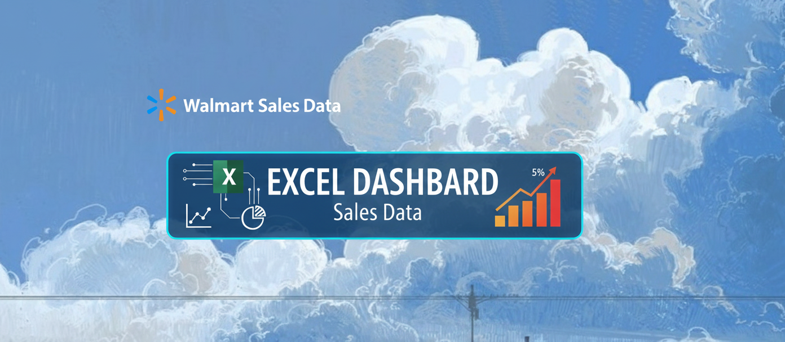
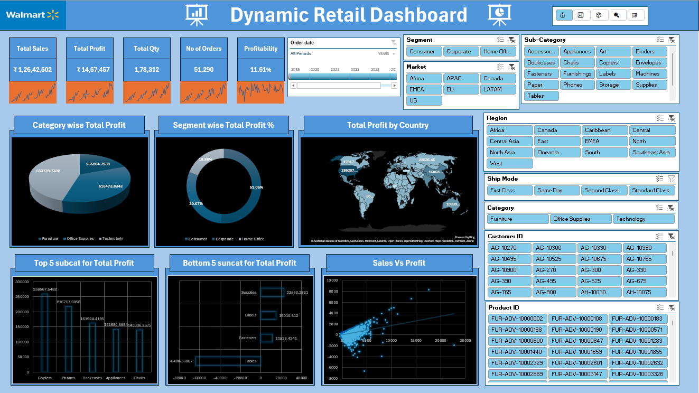
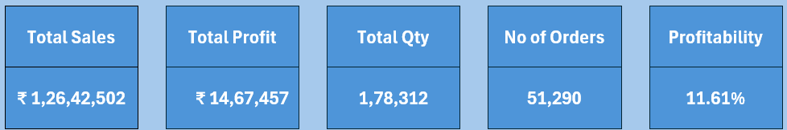
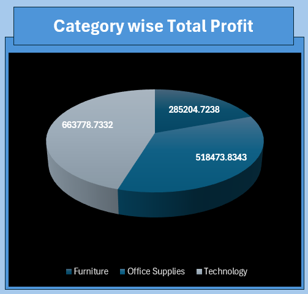
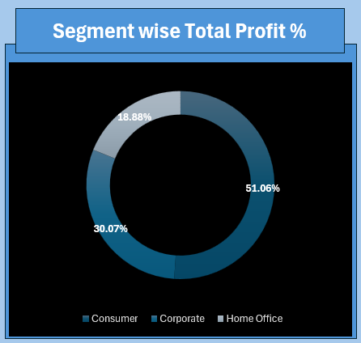
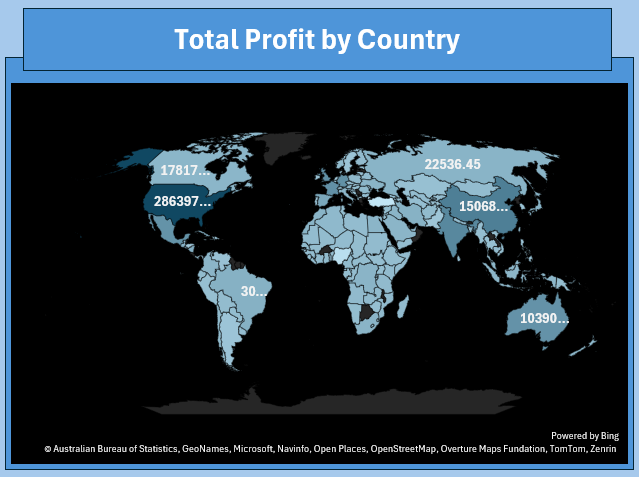
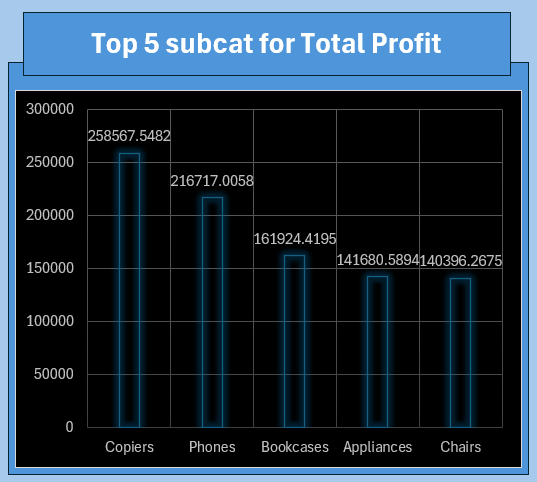
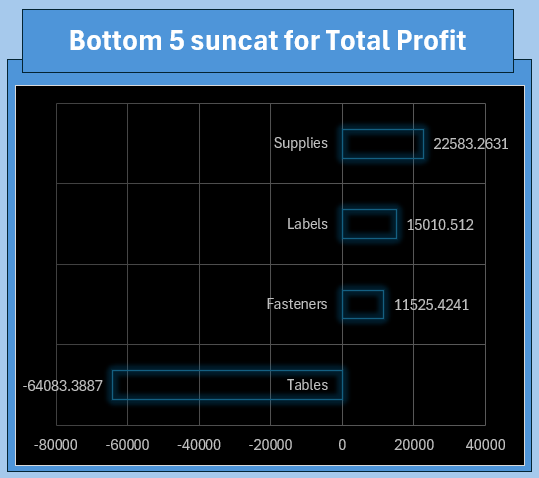
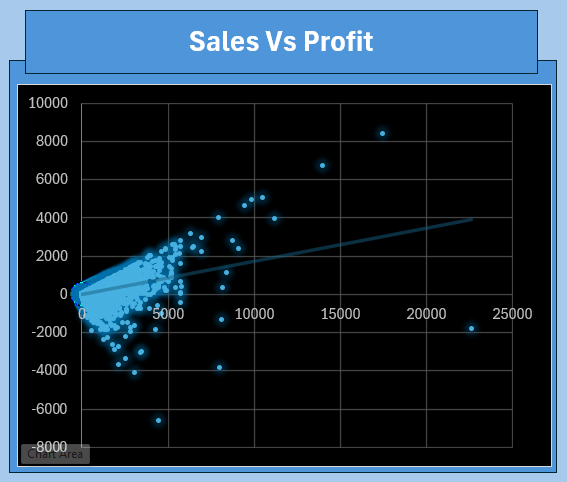

# 🛍️ Dynamic Retail Dashboard  
### Unlocking Retail Insights Through Data Visualization and Automation  



> A fully interactive **Excel-based Retail Analytics Dashboard** that transforms raw retail data into actionable business insights.  
> Designed to highlight expertise in **data visualization**, **Excel automation**, and **business analytics** — empowering data-driven decisions.

---

## 📊 Project Overview  

The **Dynamic Retail Dashboard** delivers a powerful analytical overview of sales, profit, and customer segments across multiple dimensions.  
It enables business users to identify growth opportunities, understand performance trends, and visualize KPIs interactively.

This project is built entirely in **Microsoft Excel**, demonstrating how far advanced Excel automation and design principles can go in creating a professional Business Intelligence tool.

---

## ✨ Key Features  

✅ **Dynamic Visualization** – Interactive charts with slicers for segmentation, market, and category analysis.  
✅ **Automated Reporting** – Live data refresh using formulas, pivot tables, and Power Query.  
✅ **KPI Tracking** – At-a-glance insights on Sales, Profit, Orders, and Profitability.  
✅ **Drill-Down Analysis** – Filter data by Region, Segment, Ship Mode, and more.  
✅ **Clean, Professional UI** – Optimized layout and theme inspired by modern BI dashboards.  

---

## 🧠 Tools & Technologies  

| Tool | Purpose |
|------|----------|
| **Microsoft Excel** | Core dashboard design & analytics |
| **Pivot Tables** | Dynamic aggregation of metrics |
| **Charts & Visuals** | Visualization of KPIs and trends |
| **Power Query** | Data cleaning and transformation |
| **Formulas (VLOOKUP, INDEX-MATCH, IF)** | Automation and dynamic linking |
| **Slicers & Timelines** | Interactive filtering controls |
| **Conditional Formatting** | Data-driven visual indicators |

---

## 📸 Dashboard Showcase  

### 🖥️ Full Dashboard View  


---

### 💡 KPI Summary  
The top section provides key retail performance metrics like Total Sales, Profit, Orders, and Profitability.  


---

### 🧩 Category and Segment Insights  
| Category-wise Profit | Segment-wise Profit % | Profit by Country |
|:--------------------:|:--------------------:|:-----------------:|
|  |  |  |

---

### 📊 Sub-Category Performance  
| Top 5 Subcategories | Bottom 5 Subcategories | Sales vs Profit |
|:--------------------:|:----------------------:|:----------------:|
|  |  |  |

---

## 📈 Insights Generated  

💡 **Technology** and **Office Supplies** emerge as the most profitable categories.  
💡 The **Corporate Segment** contributes over half of total profit.  
💡 **APAC** and **US** markets show the highest profitability margins.  
💡 Negative profit items can be identified instantly using visual cues in the bar charts.  
💡 The scatter plot clearly visualizes the **sales-to-profit correlation**, highlighting outliers.

---

## 🗂️ Repository Structure  

```

📦 Dynamic_Retail_Dashboard
│
├── 📊 Dashboard.xlsx                # Main Excel dashboard file
│
├── 🖼️ assets/                       # Contains all visuals for README
│   ├── dashboard_banner.png
│   ├── dashboard_overview.png
│   ├── kpi_summary.png
│   ├── category_profit.png
│   ├── segment_profit.png
│   ├── country_profit.png
│   ├── top5_subcategory.png
│   ├── bottom5_subcategory.png
│   └── sales_vs_profit.png
│
└── 📘 README.md                     # Project documentation

````

---

## 🚀 How to Use  

1. **Clone the repository**  
   ```bash
   git clone https://github.com/Mayank230604/Dynamic_Retail_Dashboard.git
````

2. **Open** `Dashboard.xlsx` in Microsoft Excel.
3. Use **Slicers** and **Filters** to explore insights dynamically.
4. Optionally replace the dataset to visualize your own business data.


## 💼 About the Creator

👨‍💻 **[Mayank Adeva](https://github.com/Mayank230604)**
A passionate **Data Enthusiast & Software Developer**, crafting powerful Excel solutions and analytical dashboards that convert data into decisions.

> *“Data doesn’t speak — until you make it visual.”*

---

## 🏷️ Tags

`#ExcelDashboard` `#DataVisualization` `#RetailAnalytics` `#BusinessIntelligence` `#Automation` `#ExcelProject` `#Analytics`

---

⭐ **If you like this project, don’t forget to give it a star on GitHub!**

